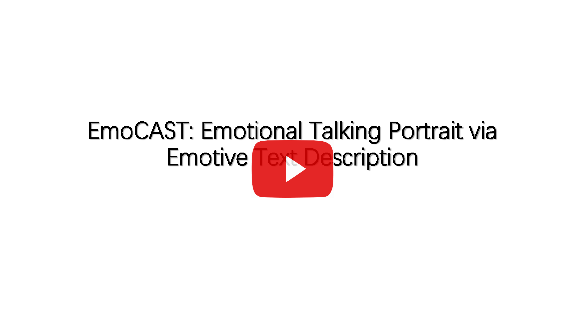
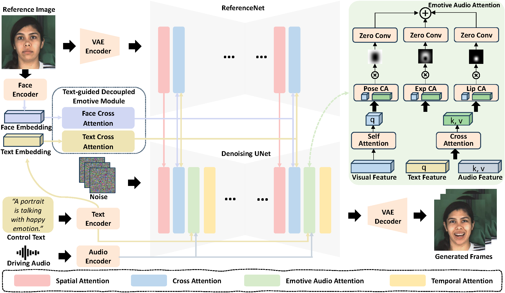

## 👿 EmoCAST: Emotional Talking Portrait via Emotive Text Description

#### Yiguo Jiang<sup>1</sup> · <a href='https://vinthony.github.io/'>Xiaodong Cun📪<sup>2</sup> </a> · <a href='https://yzhang2016.github.io/'>Yong Zhang<sup>3</sup></a> · Yudian Zheng<sup>1</sup> · <a href='https://scholar.google.com/citations?user=PdKElfwAAAAJ&hl=zh-CN'>Fan Tang<sup>4</sup></a> · <a href='https://cmpun.github.io/'>Chi-Man Pun</a>📪<sup>1</sup>
<sup>1</sup>University of Macau &nbsp;&nbsp; <sup>2</sup> <a href='https://gvclab.github.io/'>GVC Lab, Great Bay University</a> &nbsp;&nbsp; <sup>3</sup>Meituan &nbsp;&nbsp; <sup>4</sup>ICT-CAS


[](https://arxiv.org/abs/2508.20615)


We introduce **EmoCAST**, a novel diffusion-based emotional talking head system for in-the-wild images from a single image, audio, and the emotional text description.

## 📸 Video Demo

[](https://www.youtube.com/watch?v=sVxm7Lf6bY0 "EmoCAST: Emotional Talking Portrait via Emotive Text Description - YouTube")


## 🔧️ Framework



## ⚙️ Usage
### 🛠️ Installation

1. Create conda environment
   ```bash
   conda create -n emocast python=3.10
   conda activate emocast
   ```

2. Install packages with pip

   ```bash
   pip install -r requirements.txt
   pip install .
   ```

### 🎮 Inference


   

1. Download Pretrained Models
   
   Download these models below into the `./pretrained_model/` folder.
  
    |  Model | Download Link |   
    |:--------:|:------------:|
    |audio_separator |  [https://huggingface.co/huangjackson/Kim_Vocal_2](https://huggingface.co/huangjackson/Kim_Vocal_2)|
    |insightface | [https://github.com/deepinsight/insightface/tree/master/python-package#model-zoo](https://github.com/deepinsight/insightface/tree/master/python-package#model-zoo)|
    |face landmarker | [https://storage.googleapis.com/mediapipe-models/face_landmarker/face_landmarker/float16/1/face_landmarker.task](https://storage.googleapis.com/mediapipe-models/face_landmarker/face_landmarker/float16/1/face_landmarker.task) |
    |motion module | [https://github.com/guoyww/AnimateDiff/blob/main/README.md#202309-animatediff-v2](https://github.com/guoyww/AnimateDiff/blob/main/README.md#202309-animatediff-v2)|
    |sd-vae-ft-mse | [https://huggingface.co/stabilityai/sd-vae-ft-mse](https://huggingface.co/stabilityai/sd-vae-ft-mse)|
    |StableDiffusion V1.5|[https://huggingface.co/stable-diffusion-v1-5/stable-diffusion-v1-5](https://huggingface.co/stable-diffusion-v1-5/stable-diffusion-v1-5)|
    |wav2vec | [https://huggingface.co/facebook/wav2vec2-base-960h](https://huggingface.co/facebook/wav2vec2-base-960h)|
    |EmoCAST| [https://huggingface.co/Jmaomao/EmoCAST](https://huggingface.co/Jmaomao/EmoCAST)|

    These pretrained models should be organized as follows:

    ```text
    ./pretrained_models/
    |-- audio_separator/
    |   |-- download_checks.json
    |   |-- mdx_model_data.json
    |   |-- vr_model_data.json
    |   |-- Kim_Vocal_2.onnx
    |-- face_analysis/
    |   |-- models/
    |       |-- face_landmarker_v2_with_blendshapes.task  
    |       |-- 1k3d68.onnx
    |       |-- 2d106det.onnx
    |       |-- genderage.onnx
    |       |-- glintr100.onnx
    |       |-- scrfd_10g_bnkps.onnx
    |-- motion_module/
    |   |-- mm_sd_v15_v2.ckpt
    |-- sd-vae-ft-mse/
    |   |-- config.json
    |   |-- diffusion_pytorch_model.safetensors
    |-- stable-diffusion-v1-5/
    |   |-- unet/
    |       |-- config.json
    |       |-- diffusion_pytorch_model.safetensors
    |-- wav2vec/
    |   |-- wav2vec2-base-960h/
    |       |-- config.json
    |       |-- feature_extractor_config.json
    |       |-- model.safetensors
    |       |-- preprocessor_config.json
    |       |-- special_tokens_map.json
    |       |-- tokenizer_config.json
    |       |-- vocab.json
    |-- emocast/
    |   |-- net.pth
    ```

2. Prepare Inference Data

   Prepare the *driving audio*, *reference image*, and *emotive text prompt* as input.

   - For the *driving audio*, it should be in `.wav` format.

   - For the *reference image*, it should be cropped into a square with the face as the primary focus, facing forward.
  
   - For the *emotive text prompt*, it describe a specific talking scene, such as:
     
     `The portrait is experiencing chronic illness or pain.`
     
     `A person is talking with happy emotion.`

     `The portrait is watching a horror movie with jump scares.`
   
   Here, we provide [some samples](examples/) for your reference.


3. Run Inference

   We test the inference on a 24G RTX 4090.

   To run the inference script, change the `--driving_audio` and `--source_image` to the correct path and provide `--prompt_emo`.

   The generated videos will be saved in `--outputs`.
   
   ```bash
   bash inference.sh
   ```

   For more options, you can refer `scripts/inference.py`

## 🛎 Citation
If you find our work helpful for your research, please cite:
```

```

## 💗 Acknowledgements

Thanks to the [hallo](https://github.com/fudan-generative-vision/hallo), for their open research and exploration.

